# ProbeLink 🔗📡

> **Plan. Survey. Deploy.**
> An ISP Network Infrastructure Planning & Site Survey Tool for MDUs, commercial buildings, and campuses.

Built by [Krish Kant Rai](https://linkedin.com/in/krish-kant-rai-3a8734338) · [GitHub](https://github.com/krishkantrai27)

---

## 📋 Table of Contents

1. [Vision](#-vision)
2. [System Workflows](#-system-workflows)
3. [Application Features](#-application-deep-dive)
4. [Technology Stack](#️-technology-stack)
5. [Getting Started](#-getting-started)

---

## 🚀 Vision

Traditional ISP site surveys suffer from fragmented tooling, paper-based checklists, and zero traceability. **ProbeLink** solves this by:

1. **Hierarchical Property Management** — Organize sites into Properties → Buildings → Floors → Spaces.
2. **Interactive Floor Canvas** — Upload floor plans, draw space geometry, overlay RF heatmaps.
3. **Field Data Collection** — Log equipment, cable paths, and checklist responses from the field.
4. **Role-Based Access** — Admin, Engineer, and Customer roles with appropriate permissions.
5. **PDF Report Generation** — One-click reports covering floor plans, equipment inventory, checklists, and RF scan coverage.
6. **Immersive UI & Theming** — High-performance interactive background animations, theme-aware components, and full light/dark mode support.

---

## 🔄 System Workflows

### Workflow 1: Admin — Property & User Setup

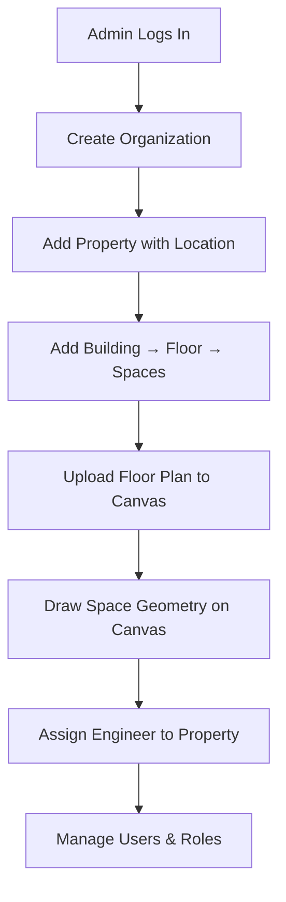
```mermaid
graph TD
    A[Admin Logs In] --> B[Create Organization]
    B --> C[Add Property with Location]
    C --> D[Add Building → Floor → Spaces]
    D --> E[Upload Floor Plan to Canvas]
    E --> F[Draw Space Geometry on Canvas]
    F --> G[Assign Engineer to Property]
    G --> H[Manage Users & Roles]
```

**Step-by-Step:**
1. Create ISP organization(s) with contact details.
2. Add property (campus/MDU/building) with address and GPS coordinates.
3. Build hierarchy — buildings, floors, and named spaces per floor.
4. Upload floor plan PNG and open the canvas to map space polygons.
5. Assign engineers, manage roles, approve/deactivate accounts.

---

### Workflow 2: Engineer — Field Survey

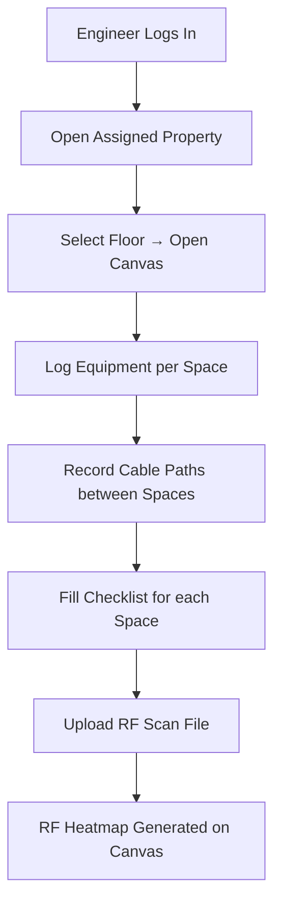
```mermaid
graph TD
    A[Engineer Logs In] --> B[Open Assigned Property]
    B --> C[Select Floor → Open Canvas]
    C --> D[Log Equipment per Space]
    D --> E[Record Cable Paths between Spaces]
    E --> F[Fill Checklist for each Space]
    F --> G[Upload RF Scan File]
    G --> H[RF Heatmap Generated on Canvas]
```

**Step-by-Step:**
1. Navigate to assigned property and open the floor canvas.
2. Log network equipment (routers, switches, APs, etc.) to specific spaces.
3. Record cable routes between spaces with medium type and length.
4. Complete admin-defined checklists for each space.
5. Upload RF scan files (Vistumbler/Kismet) — heatmap auto-renders on canvas.

---

### Workflow 3: Admin — Report Generation

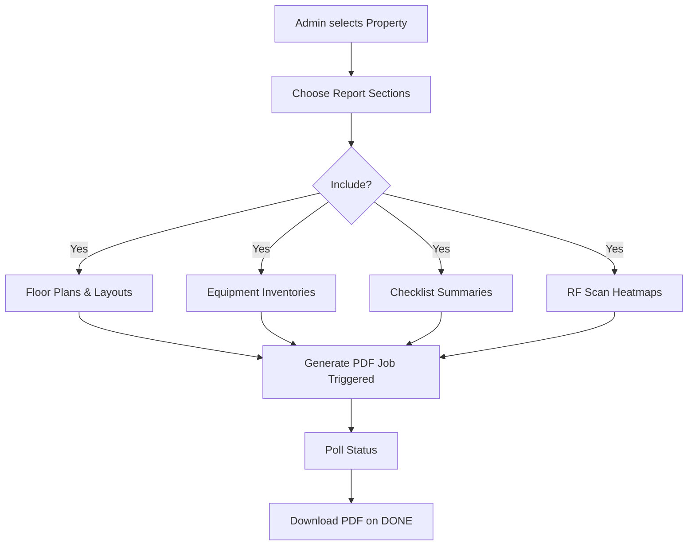
```mermaid
graph TD
    A[Admin selects Property] --> B[Choose Report Sections]
    B --> C{Include?}
    C -->|Yes| D[Floor Plans & Layouts]
    C -->|Yes| E[Equipment Inventories]
    C -->|Yes| F[Checklist Summaries]
    C -->|Yes| G[RF Scan Heatmaps]
    D & E & F & G --> H[Generate PDF Job Triggered]
    H --> I[Poll Status]
    I --> J[Download PDF on DONE]
```

---

## 📸 Application Deep-Dive

### 🔐 Authentication & Onboarding

| Feature | Description | Screenshot |
|:---|:---|:---|
| **Login** | Secure sign-in with JWT session management. Features an immersive 8-directional animated globe background and circuit-style glowing borders. Supports light/dark mode. | 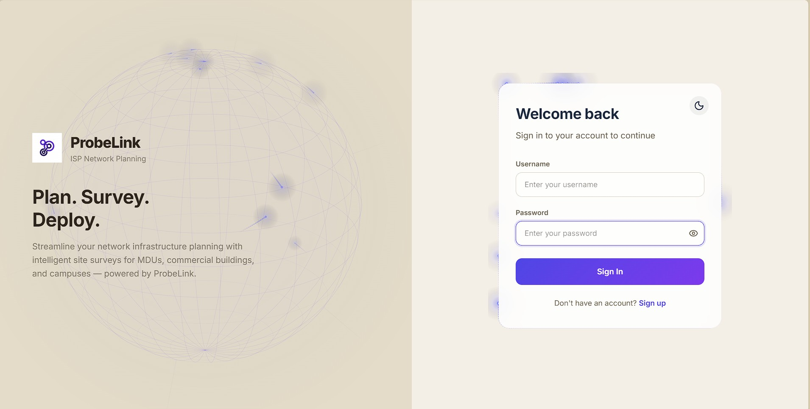 |
| **Registration** | New accounts default to Customer role. Admin can reassign role post-registration. Engineers and Admins gain elevated access. | 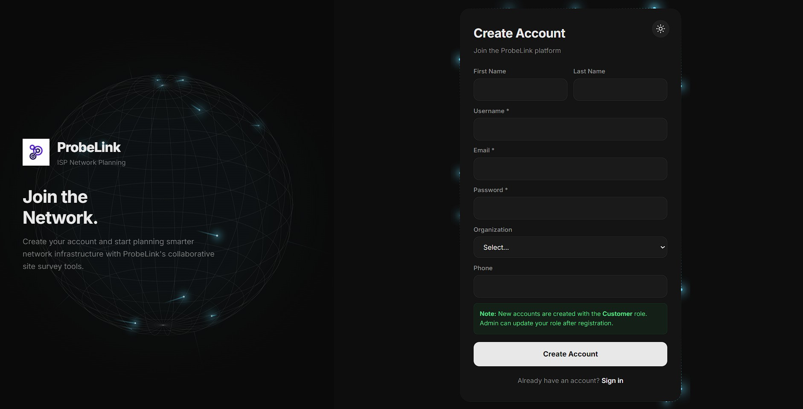 |

---

### 🏢 Organizations

Admins manage ISP organizations — the top-level grouping for properties and users.

| Page | Description | Screenshot |
|:---|:---|:---|
| **Org List** | View all registered organizations with contact info. Add or edit orgs. | 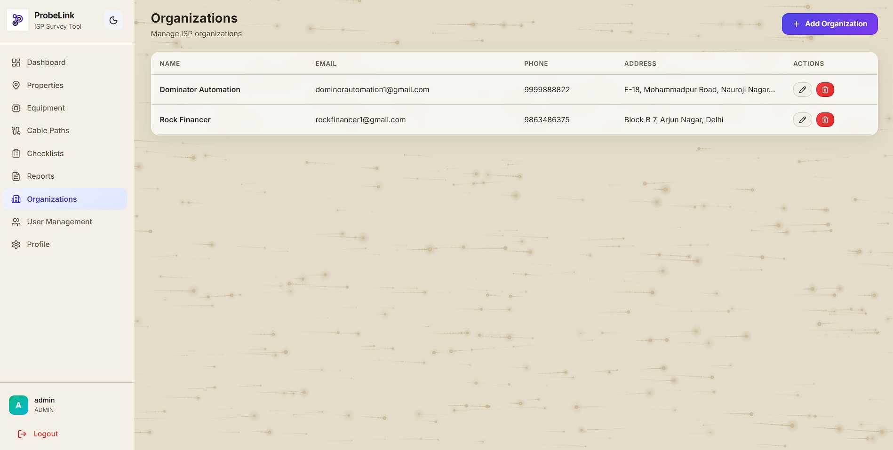 |
| **Edit Org** | Update name, email, phone, and address for any organization. | 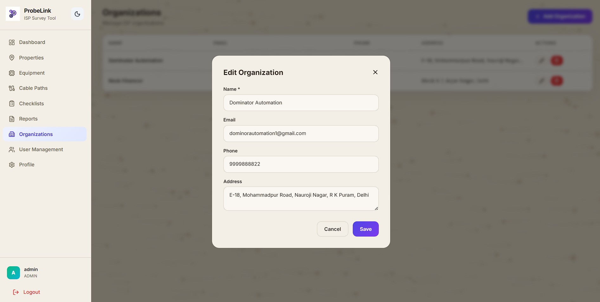 |

---

### 📊 Dashboard

Central workspace snapshot for admins and engineers.

| Metric | What It Shows |
|:---|:---|
| **Properties / Spaces / Equipment / Cable Paths / RF Scans** | Platform-wide count tiles |
| **Survey Completion** | Per-property progress — spaces with submitted checklists vs. total |
| **Checklist Distribution** | Submitted vs. draft count per template |
| **RF Scan Coverage** | % floors scanned per property |
| **Properties Overview** | Table: buildings, floors, spaces, equipment, cables, checklists, progress per property |

*The dashboard features a continuous data-flow circuit animation background for an enhanced modern aesthetic.*

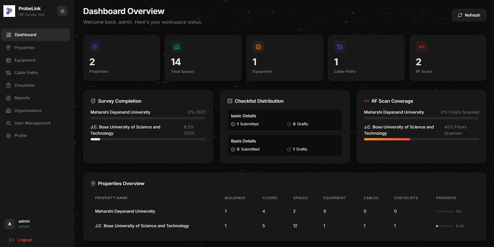

---

### 🏗️ Properties & Hierarchy

Build the full site hierarchy from property down to individual spaces.

| Page | Description | Screenshot |
|:---|:---|:---|
| **Property Cards** | All properties shown as cards with type, org, address. | 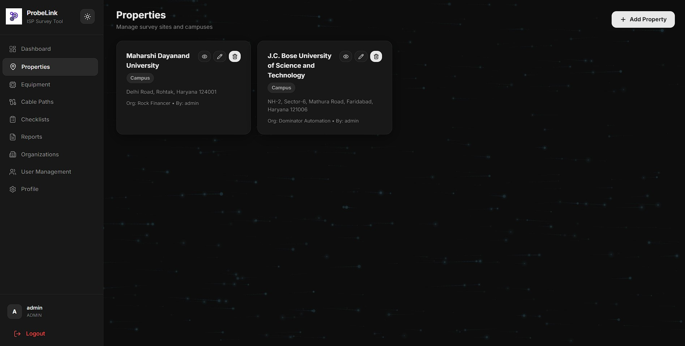 |
| **Edit Property** | Set name, type (Campus/MDU/etc.), organization, address, GPS coordinates, assigned engineer. | 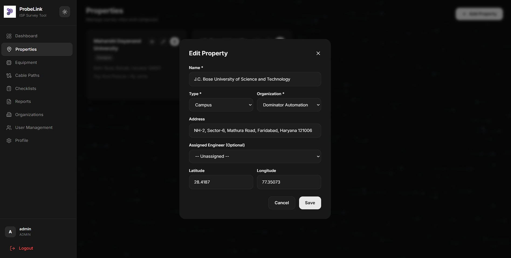 |
| **Building & Floor Tree** | Drill into a property to see buildings → floors → spaces. Upload floor plan per floor. | 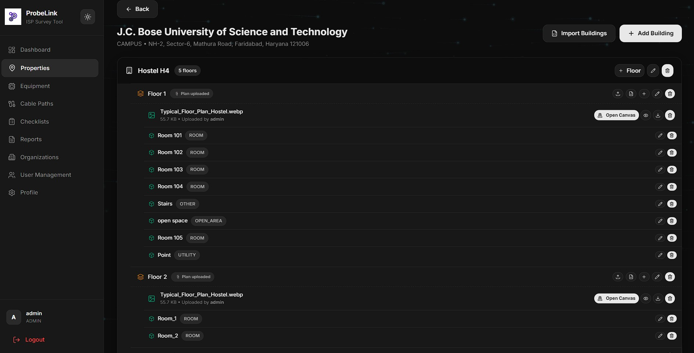 |
| **Floor Canvas** | Interactive canvas — open RF heatmap overlays, view/select spaces, inspect equipment and checklists per space. | 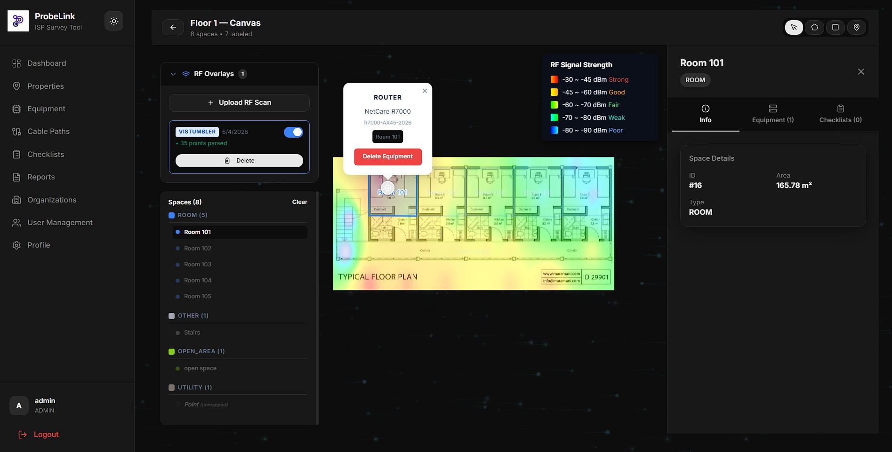 |

The canvas shows live **RF signal strength** (color-coded -30 to -90 dBm), space geometry labels, and per-space side panels with Info, Equipment, and Checklists tabs.

---

### 🖥️ Network Equipment

Inventory of installed hardware across all spaces.

| Page | Description | Screenshot |
|:---|:---|:---|
| **Equipment List** | All logged devices with type badge, vendor/model, and space location. | 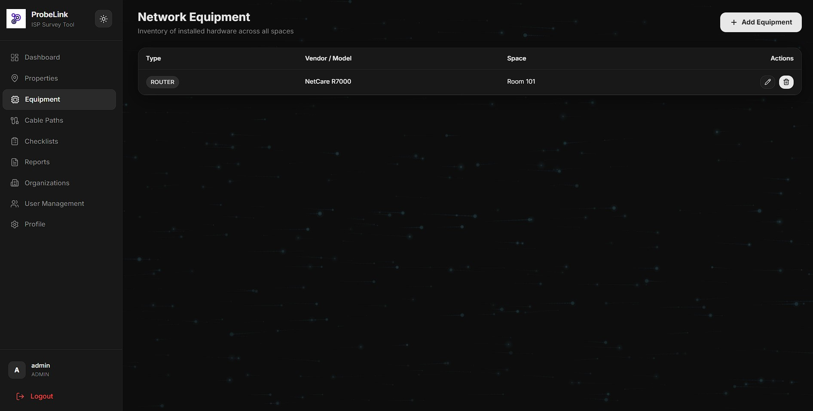 |
| **Edit Equipment** | Select property hierarchy (property → building → floor → space), type, vendor, model, serial number. | 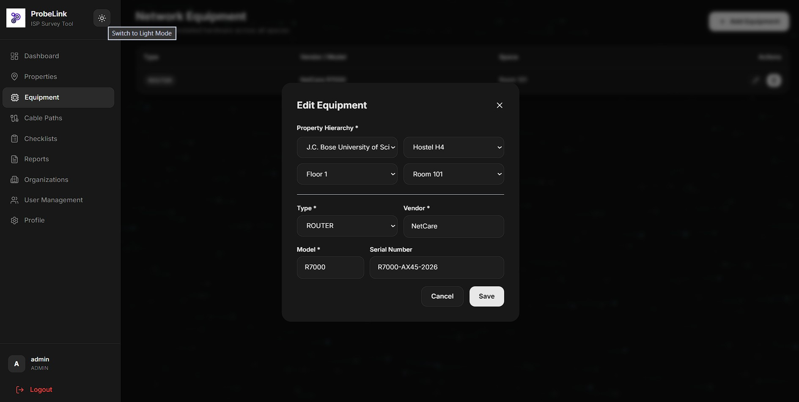 |

**Supported equipment types:** Access Point, Switch, Router, ONT, Antenna, Cabinet, UPS, Other.

---

### 🔌 Cable Paths

Physical cable routing documentation between spaces.

| Page | Description | Screenshot |
|:---|:---|:---|
| **Cable List** | All routes with medium type badge, property, and space-to-space path. | 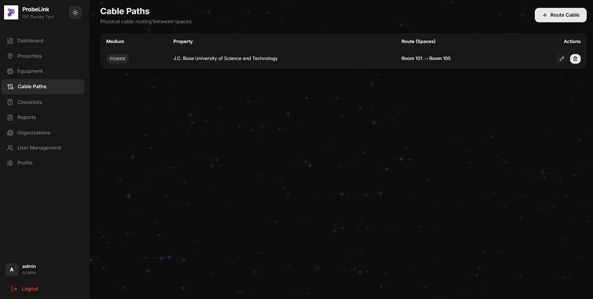 |
| **Edit Cable Path** | Select property, from/to spaces, cable medium, and length in meters. | 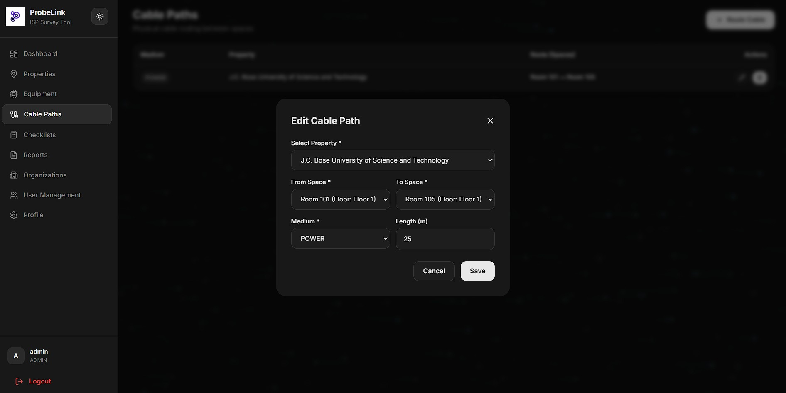 |

**Supported mediums:** Copper, Fiber, Coax, Power.

---

### ✅ Checklists

Admin-defined survey templates filled by engineers per space.

| Page | Description | Screenshot |
|:---|:---|:---|
| **Templates** | Create and manage versioned checklist templates. Each template scoped to an org and space type. | 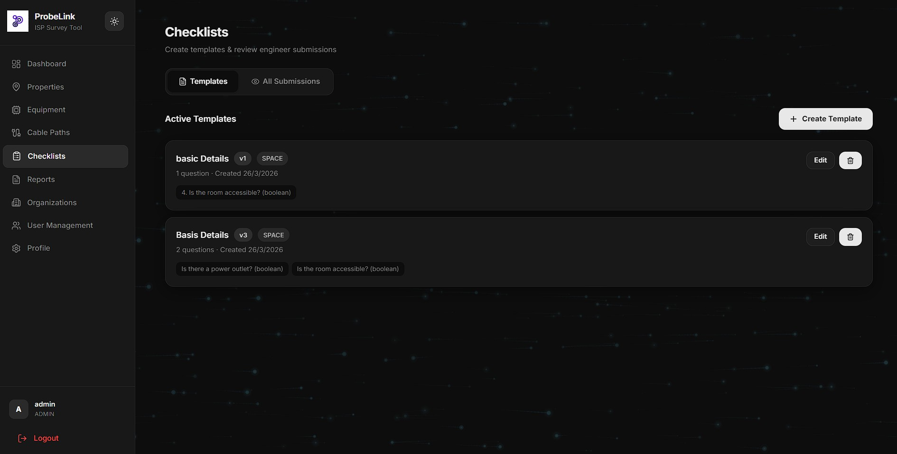 |
| **Edit Template** | Add schema fields with types: Text, Number, Yes/No, Dropdown. Mark fields as required. Updates create a new version. | 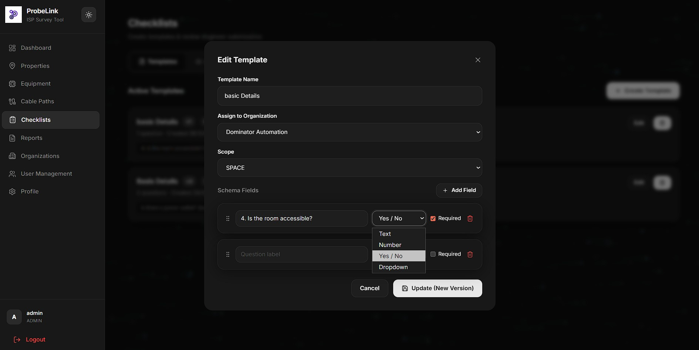 |
| **All Submissions** | View engineer-submitted responses per template and space. Submitted checklists display the engineer's name and organization. Drafts remain hidden from admins until finalized. | 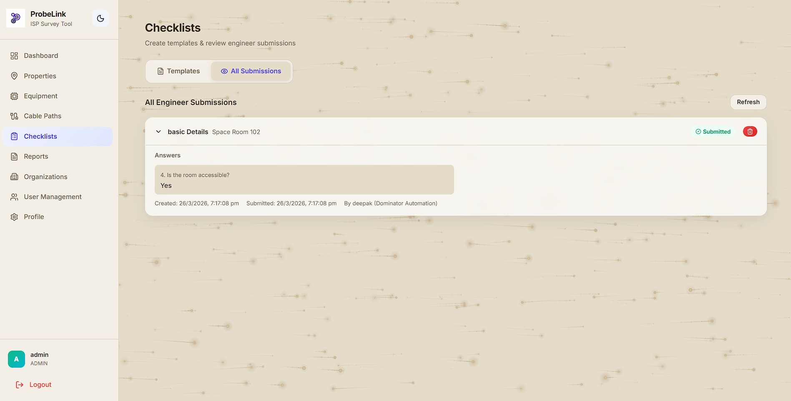 |

---

### 📄 PDF Reports

Generate comprehensive site survey reports on demand.

| Page | Description | Screenshot |
|:---|:---|:---|
| **Reports** | Select a property, choose sections to include, trigger PDF generation. View and download completed reports. | 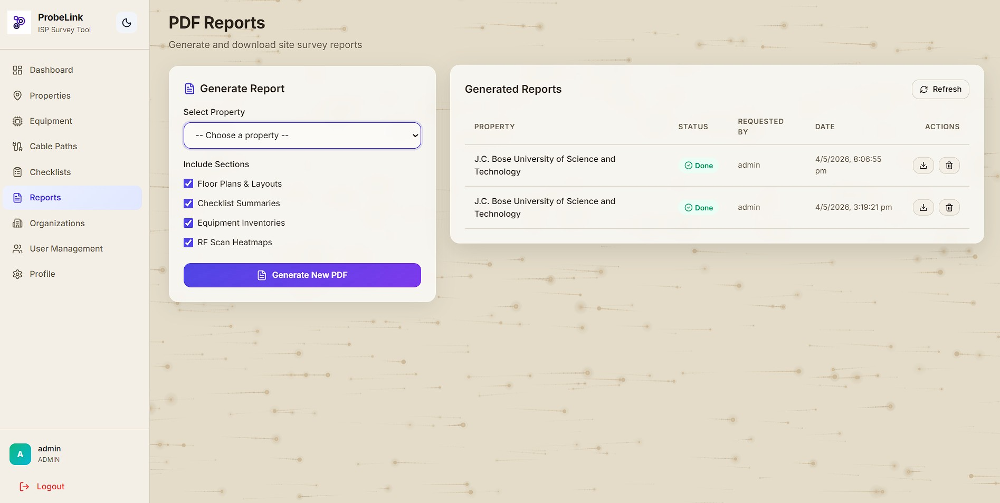 |

**Report sections:** Floor Plans & Layouts · Checklist Summaries · Equipment Inventories · RF Scan Heatmaps.

---

### 👥 User Management

Admin controls for all platform users.

| Page | Description | Screenshot |
|:---|:---|:---|
| **Pending Requests** | Review and approve new registrations before access is granted. | 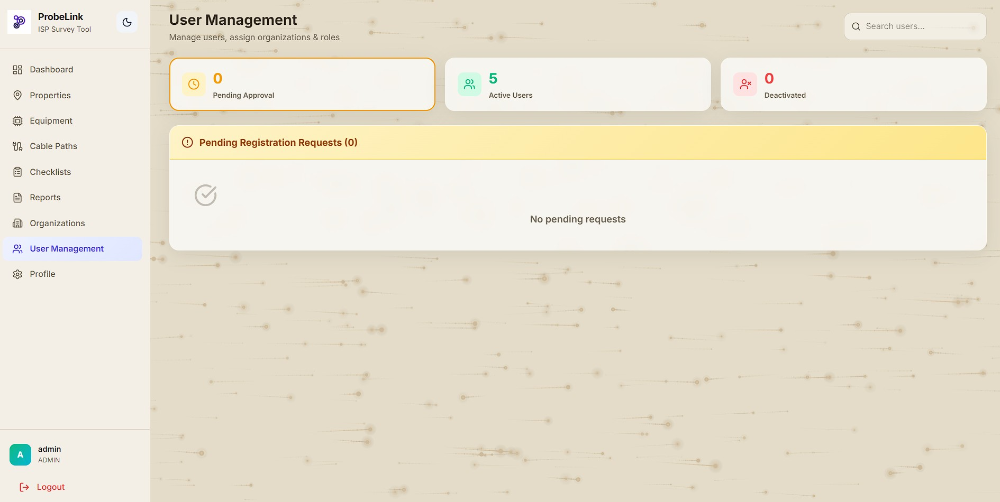 |
| **Active Users** | Full user list with inline role and organization assignment. Deactivate or delete accounts. | 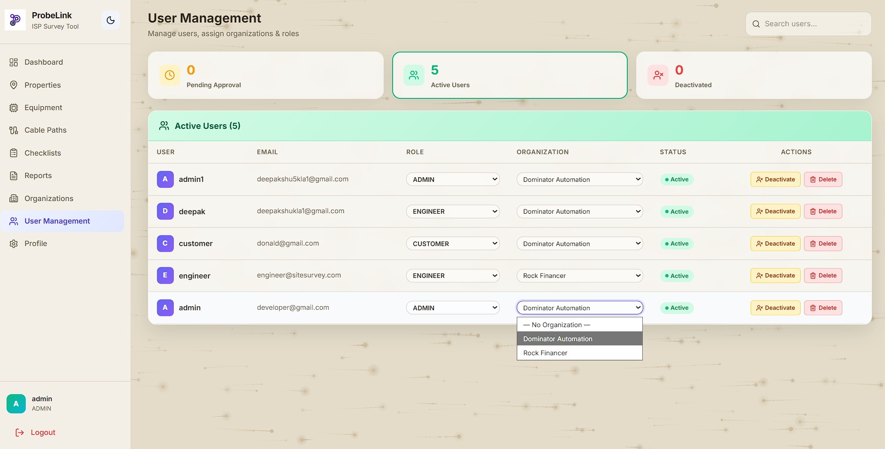 |

**Roles:** Admin · Engineer · Customer.

---

### 👤 Profile

Users can update their profile details and securely upload a custom avatar photo using the dynamic avatar modal.

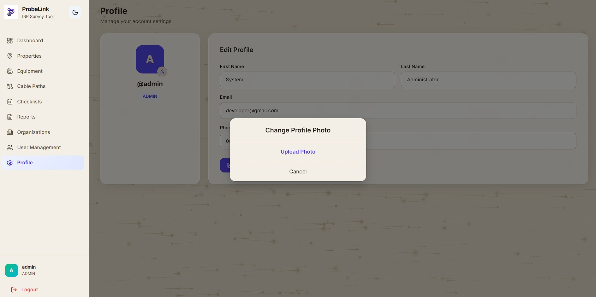

---

## 🛠️ Technology Stack

| Layer | Technology |
|:---|:---|
| **Frontend** | React 18 (Vite), Tailwind CSS |
| **Backend** | Spring Boot 3.4+ (Java 21), Spring Security, JWT |
| **Database** | MySQL 8.0 |
| **Storage** | Abstracted FileStorage (Local / MinIO S3) |
| **Migration** | Flyway DB |
| **Maps / Canvas** | Custom SVG Canvas + Heatmap Overlay |
| **DevOps** | Docker, Docker Compose, Nginx |

### System Architecture

```
infosys-site-survey/
├── backend/
│   └── src/main/java/com/sitesurvey/
│       ├── controller/     # REST API endpoints
│       ├── service/        # Business logic
│       ├── entity/         # JPA entities
│       └── repository/     # Spring Data repos
└── frontend/
    └── src/
        ├── pages/          # React page components
        ├── services/       # Axios API layer
        └── utils/          # Helpers
```

---

## 🏁 Getting Started

### Prerequisites

| Tool | Version |
|:---|:---|
| Java | 21+ |
| Node.js | 20+ |
| Docker | Latest |
| Docker Compose | v2+ |

MySQL is handled by Docker — no local install needed.

### Installation

**1. Clone**
```bash
git clone https://github.com/krishkantrai27/Infosys-site-survey-tool-for-ISP.git
cd Infosys-site-survey-tool-for-ISP
```

**2. Backend**
```bash
# Configure application.properties with DB and JWT settings
cd backend
./mvnw spring-boot:run
```

**3. Frontend**
```bash
cd frontend
npm install
npm run dev
```

Open `http://localhost:5173` — API runs at `http://localhost:8080`.

### Quick Start by Role

#### For Admins
1. Login with admin credentials.
2. Create organizations and add properties.
3. Build property hierarchy (buildings → floors → spaces).
4. Upload floor plans, open canvas, draw space geometry.
5. Create checklist templates and assign engineers.
6. Monitor survey completion from dashboard.
7. Generate PDF reports when survey is complete.

#### For Engineers
1. Login and navigate to assigned property.
2. Open floor canvas — map spaces if not already done.
3. Log equipment to spaces.
4. Add cable path routes.
5. Fill checklists for each space.
6. Upload RF scan files for heatmap generation.

#### For Customers
1. Login to view assigned property reports.
2. Download generated PDF survey reports.

---

## 📄 License

This project was developed as part of the **Infosys Springboard** Java internship program.

**Platform:** ProbeLink — ISP Site Survey Tool  
**Author:** Krish Kant Rai  
**LinkedIn:** [krish-kant-rai-3a8734338](https://linkedin.com/in/krish-kant-rai-3a8734338)  
**GitHub:** [krishkantrai27](https://github.com/krishkantrai27)

---

*Made with 📡 for smarter network infrastructure planning*
